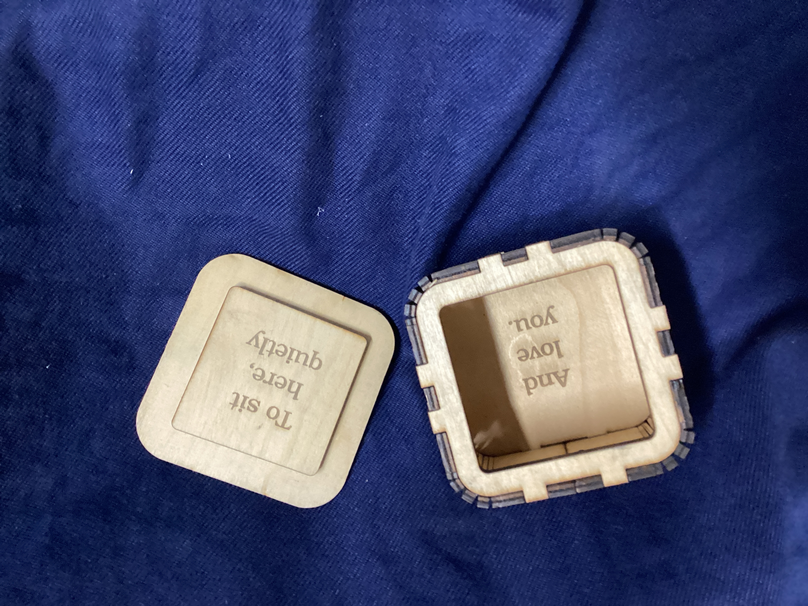
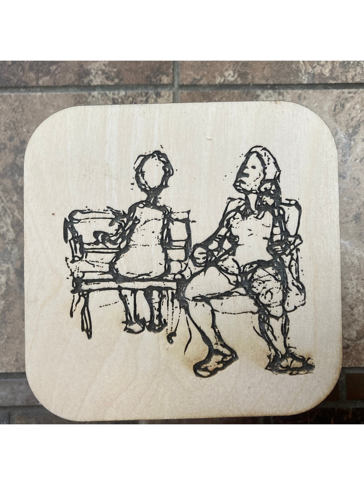
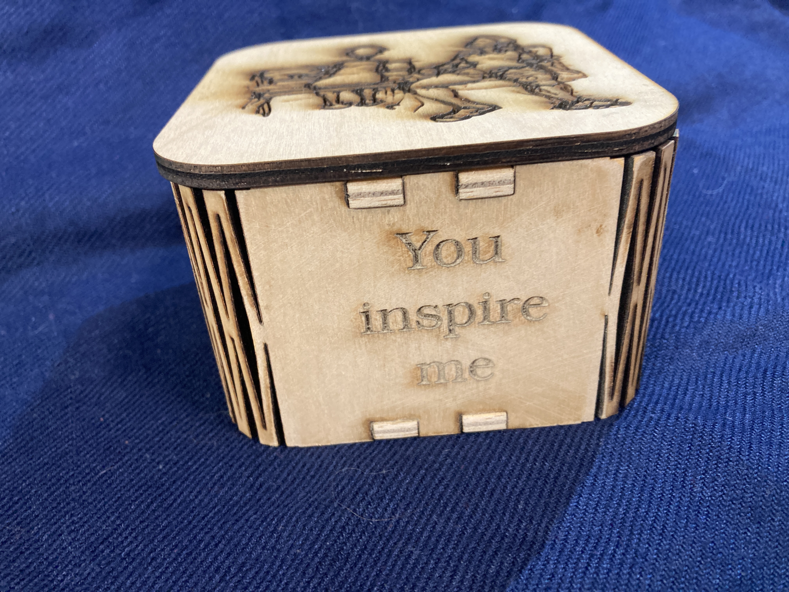

# Open source box  "Watch Me Dance!"

!
!
!

## Build instructions

Make one for yourself or your friends!  Please record your work in the [manifest](./MANIFEST.md),
including any adjustments you made for materials, etc.

## Support files
* [Raw SVG](book.svg)
* [QR code image](qr.png)
* [Line drawing](watch-me-dance.jpg)
* [XCS](watch-me-dance.xcs)
* [Lightburn](./book.lbrn2)
